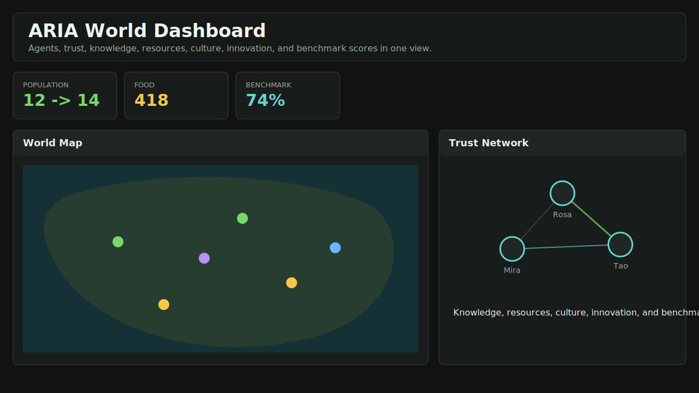

# ARIA

**Developmental Cognitive Architecture** — intelligence that emerges from experience, not presets.

ARIA is a research platform for studying how memory, identity, and values can emerge from accumulated experience rather than being hardcoded. The system demonstrates that developmental mechanisms improve task performance by 13.5% with large effect size (Cohen's d = 1.799).



## Key Results

| Metric | Value |
|--------|-------|
| Performance improvement | **+13.5%** |
| Statistical significance | **p < 0.001** |
| Effect size | **d = 1.799 (large)** |
| Memory influence contribution | **+14.5%** |
| Stress resilience | **82.6-100%** |
| Test coverage | **74/74 passing** |

## What Makes ARIA Different

### Memory-Informed Reasoning

Instead of fixed rules, ARIA learns from experience:

```
Experience → Memory → Influence Signals → Better Decisions
```

The memory influence engine creates behavioral biases from repeated successes and failures. After observing that action X succeeds 80% of the time, the agent naturally prefers X.

### Emergent Identity

Identity is not a personality preset. It emerges from accumulated outcomes:

```
Experience → Patterns → Stable Preferences → Identity
```

After 50+ episodes, the agent develops:
- Action preferences (what it prefers to do)
- Risk tolerance (how bold it is)
- Social orientation (how much it values interaction)

### Value Formation

Values emerge from repeated outcomes, not hardcoded rules:

```
Outcomes → Signals → Stable Values → Future Decisions
```

The agent learns to value efficiency, reliability, safety, and other qualities based on what actually works.

### Multi-Hypothesis Reasoning

Instead of generating one plan, ARIA generates multiple candidates and selects the best:

```
Objective → Generate N Plans → Score Each → Select Best → Execute
```

Scoring uses memory-informed heuristics that learn from experience. Penalties for risk and complexity are adaptive — they adjust based on whether complex/risky plans actually succeed.

## Quick Start

```bash
# Run the world simulation dashboard
python run_dashboard.py --days 60 --agents 12 --seed 42

# Open the generated dashboard
docs/screenshots/world_dashboard.html

# Run the text interface
python -m text_mode_loop

# Run all tests
python -m pytest tests/ -q
```

## Architecture

```
aria_core/
├── reasoning/
│   ├── engine.py           # Reasoning pipeline
│   └── multi_hypothesis.py # Multi-hypothesis planning
├── memory/
│   ├── influence.py        # Memory influence engine
│   └── ...
├── identity/
│   ├── formation.py        # Identity emergence
│   └── persistence.py     # SQLite persistence
├── values/
│   ├── formation.py        # Value emergence
│   └── persistence.py     # SQLite persistence
├── cognitive/
│   ├── engine.py           # Cognitive integration
│   └── state.py           # Internal state
└── ...

aria_world/
├── world.py               # World simulation
├── agent.py               # ARIA-powered agents
└── dashboard.py           # Visualization
```

## Experiments

### Developmental Cognition

120 seeds × 7 conditions × 100 episodes = 84,000 episodes:

| Condition | Improvement | p-value | Cohen's d |
|-----------|-------------|---------|-----------|
| Memory Only | +14.5% | <0.001 | 1.773 |
| Identity Only | +3.2% | <0.001 | 0.392 |
| Values Only | -0.6% | 0.457 | -0.074 |
| Full System | +13.7% | <0.001 | 1.656 |

### Memory Investigation

200 seeds × 8 conditions = 160,000 episodes:

- Memory influence is the primary driver (+14.5%)
- Identity adds behavioral consistency
- Values provide stress resilience
- Adaptive penalties learn from memory

### Stress Testing

- Catastrophic events: 82.6% resilience
- Resource scarcity: 100% resilience

## Documentation

- [Reasoning Bottleneck Analysis](docs/REASONING_BOTTLENECK_ANALYSIS.md)
- [Reasoning Improvement Summary](docs/REASONING_IMPROVEMENT_SUMMARY.md)
- [Developmental Cognition Research](docs/RESEARCH_DEVELOPMENTAL.md)
- [Comparative Experiment Analysis](docs/COMPARATIVE_EXPERIMENT_ANALYSIS.md)
- [Memory Investigation Results](docs/MEMORY_INVESTIGATION_RESULTS.md)
- [Research Paper](docs/RESEARCH_PAPER.md)

## Provider Configuration

```env
NVIDIA_API_KEY=nvapi-...
LLM_PROVIDER=nvidia
LLM_MODEL=minimaxai/minimax-m2.7
OLLAMA_URL=http://localhost:11434
```

## Tests

```bash
# Run all tests
python -m pytest tests/ -q

# Run specific test suites
python -m pytest tests/test_aria_world.py -v
python -m pytest tests/test_multi_hypothesis.py -v
python -m pytest tests/test_developmental_cognition.py -v
```

## License

Research project — see repository for details.
