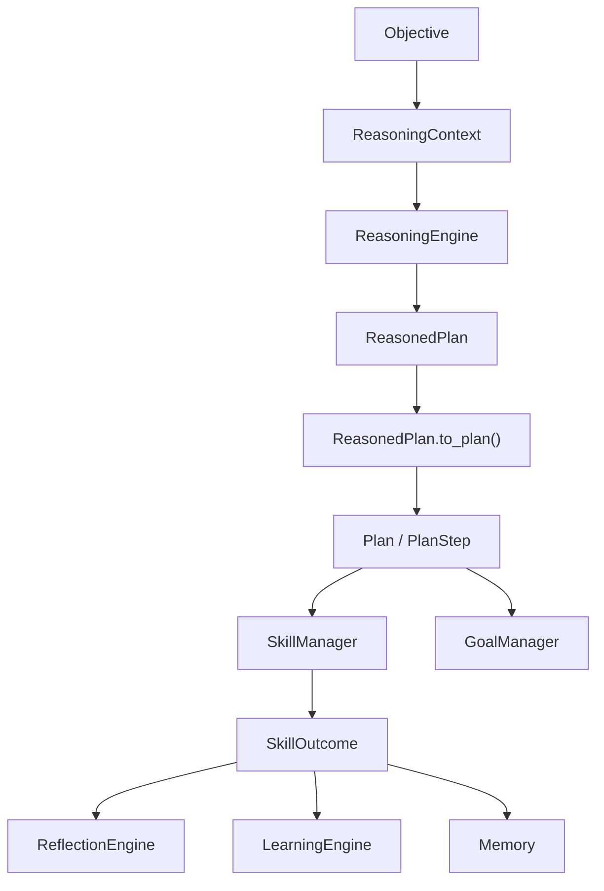

# Cognition Architecture

ARIA's cognition layer is centered on `aria_core.integration.ARIACore`.

The current canonical runtime is:

1. Gather context from goals, skills, learning, recent history, and active constraints.
2. Use `ReasoningEngine` to produce a `ReasonedPlan`.
3. Adapt the reasoned plan into typed `Plan` / `PlanStep` execution state.
4. Execute steps through `SkillManager`.
5. Record per-step outcomes into reflection, learning, and memory.
6. Update goal state and workflow learning.

## Main Components

- `GoalManager`: long-lived goals, subtasks, state transitions, progress.
- `ReasoningEngine`: objective understanding, plan generation, verification, replanning.
- `SkillManager`: registry, routing, execution, history.
- `ReflectionEngine`: outcome analysis and lesson extraction.
- `LearningEngine`: converts reflection and skill statistics into reusable knowledge.
- `SQLiteMemorySystem`: persistent episodic, working, and semantic memory.

## Current Data Flow

## Compatibility Paths

`SimpleDecisionMaker` still exists for the legacy input interpreter -> decision -> output planner loop. It should remain stable while new cognition work moves toward `ARIACore`.

## Architectural Debt

- `ReasoningEngine` still exposes raw step dictionaries.
- `PlanningEngine` and `ReasoningEngine` have overlapping plan concepts.
- Legacy runtime paths do not yet use `ARIACore`.
- Cognitive state exists separately from the canonical runtime path.

## Measurement Targets

- Task success rate.
- Replan frequency.
- Step failure rate by skill.
- Goal completion rate.
- Time to first executable plan.
- Reflection and learning usefulness over repeated tasks.
