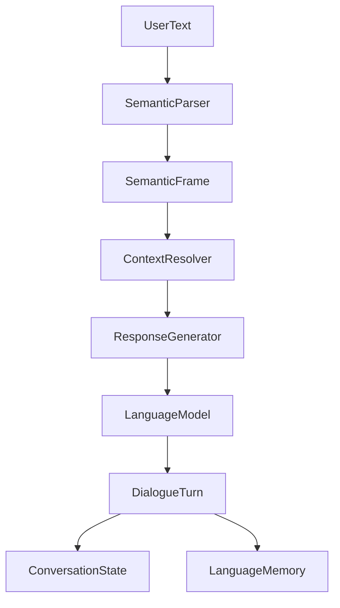

# Language Architecture

ARIA's language layer lives in `language_cortex`.

The layer preserves the original text generation API while adding structured language understanding and dialogue continuity.

## Public Facade

`LanguageCortex` supports the legacy methods:

- `generate(prompt)`
- `stream_generate(prompt)`
- `chat(user_input)`
- `chat_stream(user_input)`

It also exposes language-layer methods:

- `parse(raw_text)`
- `interpret(raw_text)`
- `resolve_context(frame)`
- `converse(user_input)`

## Components

- `SemanticParser`: converts user text into a `SemanticFrame`.
- `IntentDetector`: classifies language acts such as question, statement, create, search, remember, and open application.
- `EntityExtractor`: extracts app, emotion, time, person, and path entities.
- `ConversationState`: tracks recent turns, active topic, slots, and last intent.
- `LanguageMemory`: short-term language facts and recent turns.
- `ContextResolver`: resolves references such as "that" using state and memory.
- `ResponseGenerator`: builds grounded prompts for the configured language model.
- `DialogueManager`: orchestrates parse -> resolve -> generate -> remember.

## Data Flow

## Integration Contract

`LanguageCortex.interpret()` returns the existing `aria_core.interfaces.StructuredInput` contract, so the language layer can support the older input interpreter path without replacing it.

## Measurement Targets

- Intent accuracy.
- Entity extraction precision and recall.
- Reference-resolution accuracy.
- Dialogue state retention across turns.
- Response relevance judged against known context.
