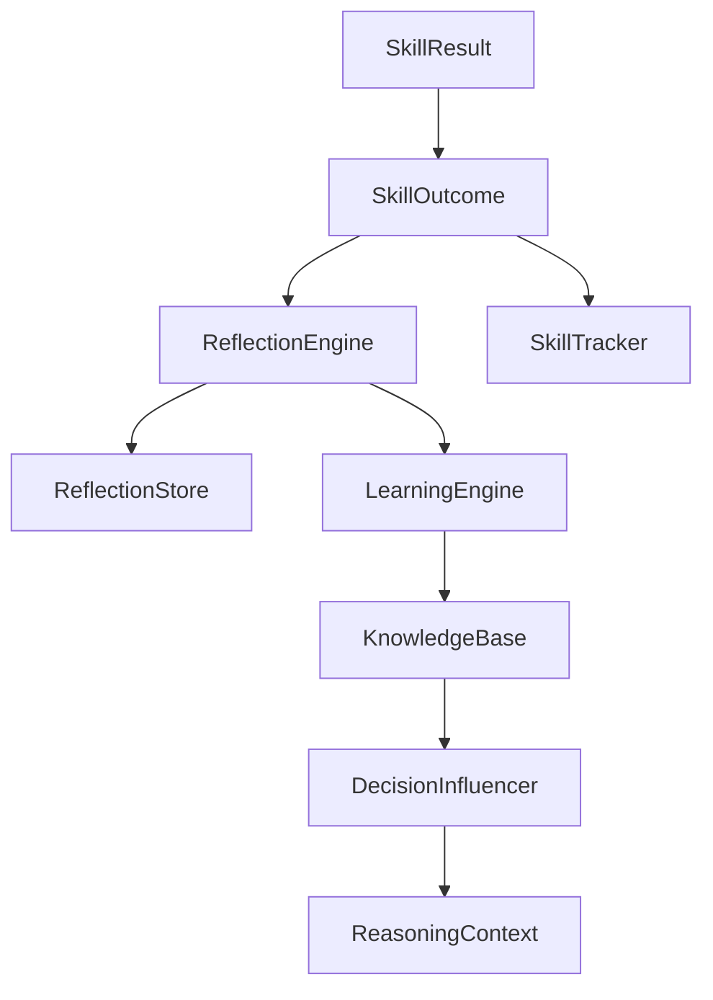

# Learning Architecture

ARIA's learning layer converts experience into reusable knowledge.

## Components

- `ReflectionEngine`: analyzes outcomes and extracts lessons.
- `ReflectionStore`: persists reflections, lessons, and skill outcomes.
- `LearningEngine`: processes reflections, skill stats, and workflows.
- `KnowledgeBase`: stores learned facts, patterns, failure modes, success strategies, workflows, and preferences.
- `SkillTracker`: tracks skill reliability and latency.
- `DecisionInfluencer`: supplies learned strategies and warnings to reasoning.

## Current Feedback Loop

## Strengths

- Learning is connected to execution outcomes.
- Skill reliability is tracked persistently.
- Learned patterns feed back into future reasoning context.

## Architectural Debt

- Learned knowledge quality is not yet benchmarked.
- Similarity search is token-based.
- Reflection quality depends heavily on result text quality.
- There is no automatic pruning or contradiction handling for learned knowledge.

## Measurement Targets

- Skill recommendation accuracy.
- Change in task success after learning.
- Duplicate knowledge rate.
- Failure-mode avoidance rate.
- Workflow reuse success rate.
