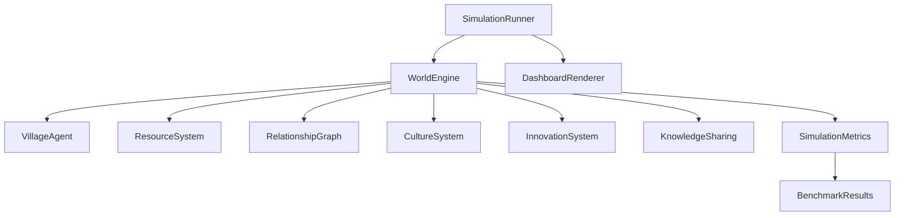

# ARIA World Architecture

ARIA World is the simulation environment for observing ARIA-powered agents over time.

## Runtime Flow



## Main Systems

- `WorldEngine`: tick loop, events, trade, conflict, reproduction, result compilation.
- `VillageAgent`: daily agent behavior and ARIA-backed reflection/learning.
- `ResourceSystem`: food, water, wood, stone, iron, tools.
- `RelationshipGraph`: trust between agents.
- `KnowledgeSharingSystem`: village-level knowledge growth.
- `CultureSystem`: customs, adherence, proven strategies.
- `InnovationSystem`: recipes, discoveries, efficiency.
- `SimulationRunner`: run, compare, benchmark, export.
- `DashboardRenderer`: static visual dashboard from result data.

## Dashboard

The dashboard is generated by:

```powershell
python run_dashboard.py
```

It renders:

- world map with animated agents
- trust network
- knowledge graph
- population
- food and resources
- innovations
- culture
- benchmark scores

## Measurement Targets

- Survival rate.
- Happiness.
- Knowledge per agent.
- Trade volume.
- Conflict rate.
- Village growth.
- Cultural adherence.
- Innovation rate.
